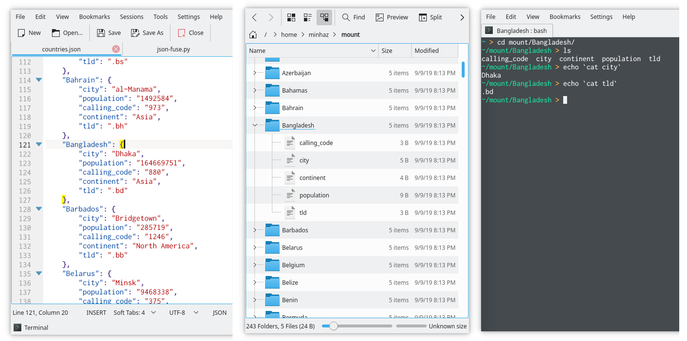

# JSON Fuse

JSONFuse is a [FUSE](https://en.wikipedia.org/wiki/Filesystem_in_Userspace) based file system that 

- uses a JSON object as source
- serves the JSON keys as directories
- serves the JSON values as files



## Motivation

Every week, I try to learn something new. And this week's topic was FUSE. I was going through the source of [s3fs](https://github.com/s3fs-fuse/s3fs-fuse) which is a FUSE based file system that uses cURL to communicate with AWS S3 API. So I was thinking I should make a FUSE based file system that will utilize a JSON file.

## Known Issues

This file system do not support creating directories/files or deleting/renaming them. Symlink is also not supported because I haven't implemented the requires functions.

Also this file system cannot read anything if the JSON has any Array `[]` inside it. Everything should be Object `{}`

## How to Run

The program is written in Python3. The following line is enough to mount the file system to any existing path.

```
python3 json-fuse.py source.json /path/to/mount/point
```
An example run-through would look like this

```
$ tail countries.json
    "Zambia": {
        "city": "Lusaka",
        "population": "17094130",
        "calling_code": "260",
        "continent": "Africa",
        "tld": ".zm"
    },
    "Zimbabwe": {
        "city": "Harare",
        "population": "16529904",
        "calling_code": "263",
        "continent": "Africa",
        "tld": ".zw"
    }
}
$ python3 json-fuse.py countries.json /mnt
$ tree /mnt/Zimbabwe
mnt
└── Zimbabwe
    ├── calling_code
    ├── city
    ├── continent
    ├── population
    └── tld
```

The program will run in foreground because I have set `foreground=True`. This can be set to `False` to make it a daemon.

## Requirements

* python3
* pip3 install fusepy (not python-fuse)

## Future Works

- [ ] Add `mkdir`, `rmdir` methods to allow creating and deleting directories
- [ ] Add `create`, `write`, `unlink` and `utimes` methods to allow creating and deleting files
- [ ] Add method for dumping JSON files when files/directories are created
